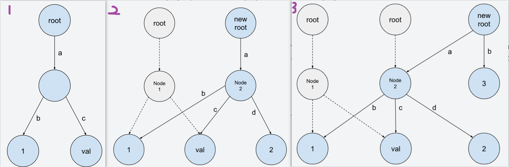
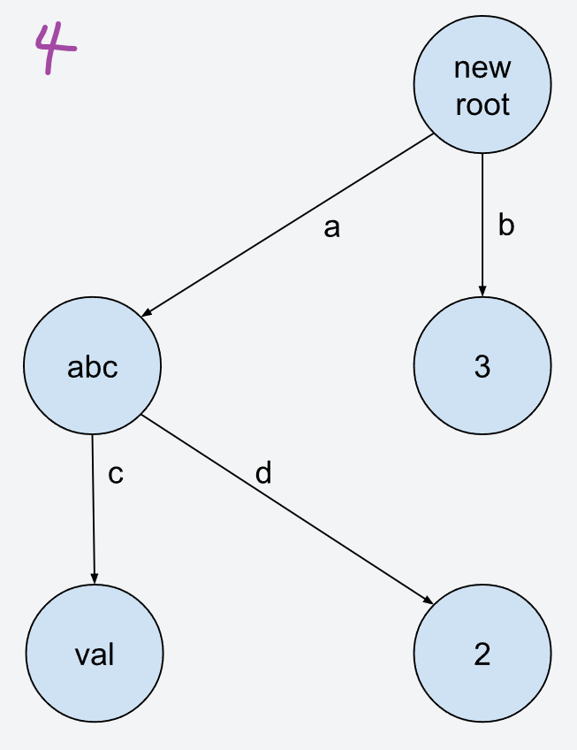
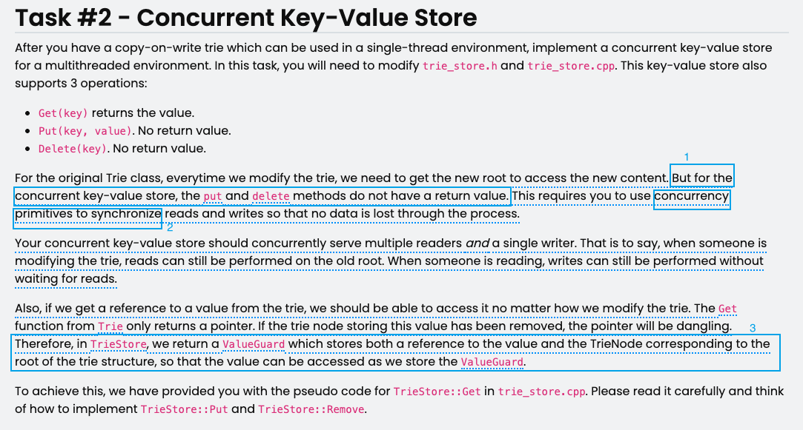

# 23fall-lab0

## copy-on-write说明

每年的lab目测都会有些不一样，特别是lab0的主题都会不一样。

23fall的lab0是实现一个copy-on-write的trie（字典树），支持查找，修改，删除操作；以及对这些操作的并行化。

这个实验的核心是让学生了解”copy-on-write“，这是DBMS中一个很重要的思想和方法，很多DBMS核心技术的实现，比如MVCC（多版本并发控制），都有”copy-on-write“的思想，可以提升DBMS的效率和支持多用户的能力；而tire只是lab0选择的一种数据结构，存储数据的结构还可以是B-tree等。

所谓”copy-on-write“写时复制，是为了保证多用户访问时，通过不加锁的方式实现数据完整性，支持支持读-读并行和读-写并行；键都用边表示，值则存在内存空间中：

例如：

原本内存中有键值对：("ab", 1) 和 ("ac", "val") 如图1。

如果要插入一个新的键值对("ad", 2)。做法是复制一个trie页，然后在这个新的trie页上加；发现”ab“和”ac“对应的值没有变，于是ab“和”ac“指向原来trie页的内存空间；而对于新增的值，则会开辟新的存储空间存放。如图2。

这时候又要插入一个新的键值对 ("b", 3)。一样也是复制一个新的tire页，发现”a“对应的值都没有变，于是”a“指向原来的内存空间。新增的("b", 3)则开辟新的边和新的空间存放。

如果这时候插入 ("a", "abc")，删除（"ab", 1)，我们会得到图4的模样。

可以想象一下过程：同样是复制一个新的tire页，插入 ("a", "abc")的时候发现尽管有("ab", 1) ，("ac", "val") 和("ad", 2)，但是a指向的那块内存空间是空的可以用，于是新的tire页的“a”指向上一个tire页的那块空间，并在里面放入“abc”。

要删除（"ab", 1)，那么顺着“a”边出发，找到“b”边和“b”指向的空间里面那块存储1的内存，把这块内存回收后，删除“b”边。

想象有两个用户A和B。

用户A想要插入("ad", 2)的同时，用户B想要读取“ac”。那么用户B读到的就是原来副本里的数据。在并发读写数据库时，copy-on-write可以做到在读操作时不用阻塞写操作，写操作也不用阻塞读操作，提高了数据库并发读写的性能。

## Concurrent Key-Value Store说明
在lab0的 task1 里面，我们实现了对tire的几个简单操作：增删查。之后，就可以支持对trie的*单线程*级操作了。

task 2要求我们可以实现并发功能：当有写操作（修改 Trie）正在进行时，读操作仍然可以在旧的根节点上进行，即允许多个读操作并发执行，读操作不会因为写操作而阻塞；当有读操作正在进行时，写操作也可以继续执行，写操作不会因为读操作而等待，即写操作不会阻塞读操作。

对于没有写过并发控制的同学（比如我）来说，需要理解实验说明里面下面几个点：

1. 为什么“But for the concurrent key-value store, the put and delete methods do not have a return value.”
为啥并发场景下，put和delete没有返回值呢？

2. 如何理解“This requires you to use concurrency primitives to synchronize reads and writes so that no data is lost through the process.” 首先，“concurrency primitives”是什么；其次，data会什么可能“lost”？

  2.1. 如果隔离机制做得不好，数据可能会出现脏读：一个Get事务读取了另一个未提交Put事务修改的数据。如果那个未提交的Put事务最终回滚（Rollback），那么Gt读取到的数据就是无效的（“脏”数据），因为它并没有真正被提交到数据库中。
  2.2. 如果没有任何同步机制，线程A和线程B可能会同时修改Trie树的同一个节点，导致其中一个线程的修改被另一个线程覆盖，从而丢失数据。

3. 为什么要设计一个“ValueGuard”？
这个还是比较好理解的。在原始的 Trie 中，Get 操作只返回一个指向值的指针。

但是现在我们是并发情景了，Get线程读的同时，也可能有一个Delete线程在修改；
这时候，如果Delete线程修改完成，那么它会返回一个新的Tire对象（没错，尽管它是copy-on-write，写的时候复制一份，但是写完后会把副本树用来替换旧的树。）而原本Get线程读取的那个 Trie 节点被删除了，那么Get操作返回的这个指针就会变成悬空指针（dangling pointer），导致访问错误。

## 实现-感悟
