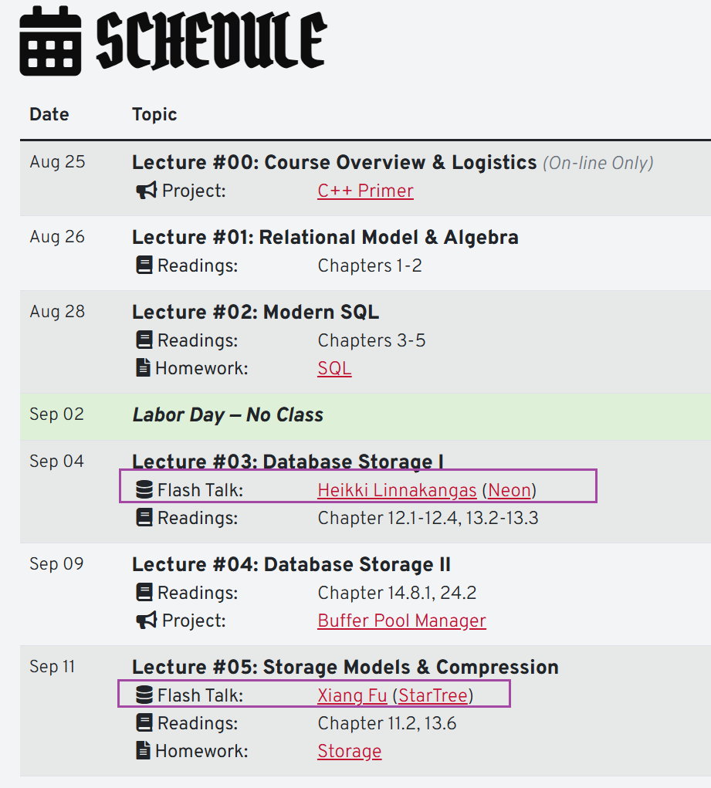

# DB-knowledge-labs
## Intro

”Theory-部分自学笔记“部分是一些应试或者学习笔记，一开始是为了整理一些数据库课程的重难点给自己和小伙伴一起复习用的，偏向应试一些；

”CMU-学习笔记“部分是记录CMU[15-445/645 ](https://15445.courses.cs.cmu.edu/fall2023)课程的笔记、拓展阅读和实验（严格遵守CMU课程要求，这里不是把实验代码开源出来，而是介绍每个实验的意义，与现实数据库系统的关联，还有记录我个人在实现过程中的感悟）；

## CMU15-445/645使用指南和建议

以我学习的23fall版本为例子：

**课程首页**；[CMU 15-445/645 :: Intro to Database Systems (Fall 2023)](https://15445.courses.cs.cmu.edu/fall2023/)

里面提供了课本的入口，如果觉得单纯看📕比较累的话，可以配合着看提供的PPT：[Database System Concepts - slides](https://www.db-book.com/slides-dir/index.html)

**schedule页面**；很多同学只做实验，看一些往年的视频课程，但是每年的schedule会更新，新的列表里面也有很多好东西，比如24fall的schedule，相比23fall，很多课程会邀请业界工程师来做分享，特别的棒

