# 关系代数

> why we need it? 因为我们输入一个查询之后，编译器会对其进行转换，最后把一个查询表示成关系代数的形式；之后查询优化器把关系代数表达式转换成一棵树，然后在树结构的基础上进行优化。

[TOC]

### 符号定义

首先记住这些符号

**1、基本的**

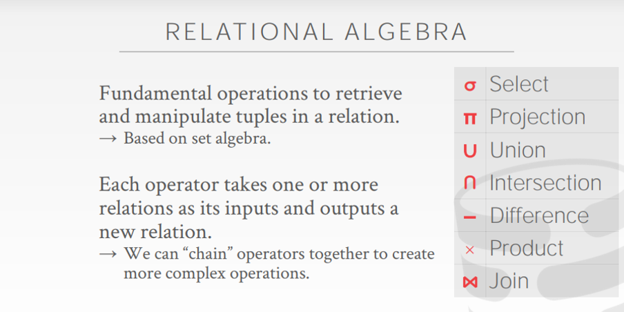

select和projection两个符号经常一起用，可能容易混淆，这里解释一下：

select是“选择条件”，projection一般是“选择符合条件的属性”

**2、另一种投射**

通过算术投射建立新的表格

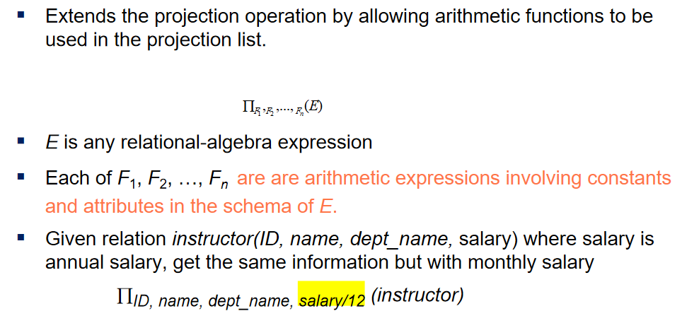

**3、聚合操作**

如果是avg、min、max、sum、count怎么表示呢

用一个写得很骚的G，看几个例子，G前面的一般是属性名（group by后面的）或者不加东西，后面就是聚合信息的来源表

eg1:

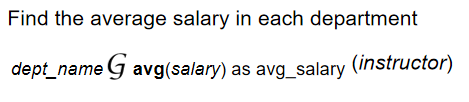

eg2：

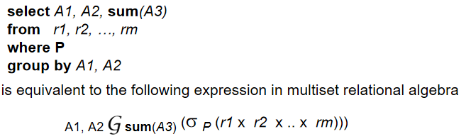

eg3：

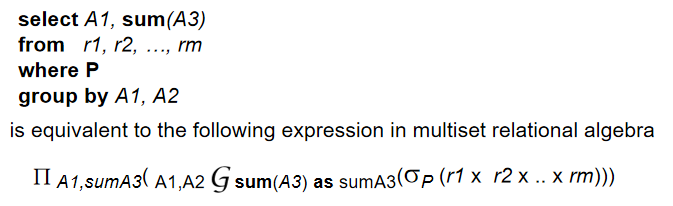

**4、商**

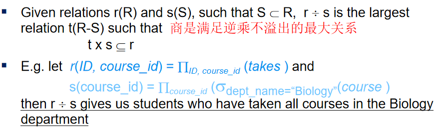

### 例题

嗯，理解了之后，目的1：考试；目的2：查询优化的时候用到

这里先应付考试

#### Example1

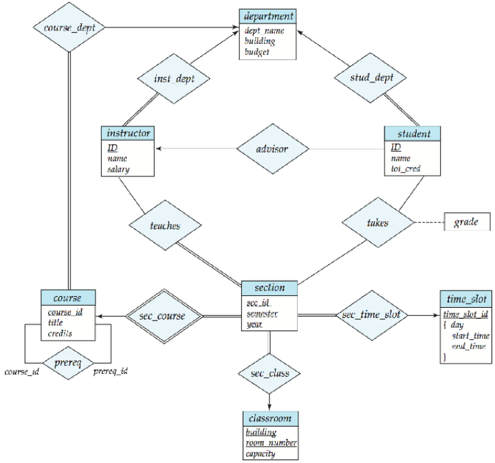


    1. Find the names of all students who have taken at least one Comp.Sci. course.
    2. Find the IDs and names of all students who have not taken any course offering before Spring 2009.
    3. For each department, find the maximum salary of instructors in that department. You may assume that every department has at least one instructor.
    4. Find the lowest, across all departments, of the per-department maximum salary computed by the prededing query.I.

```
1、先把学生和上的课程连接成为一个表；取出有Comp.Sci. course的行(组成一个表)；(上面2步可以一起做了)；选出学生的名字
```

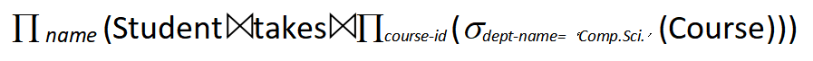

```
2、先把学生和上的课程连接成为一个表；选出条件take any course offering before Spring 2009；选出学生和学号；减去
```

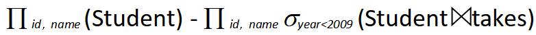

```
3、是按照department聚合的，所以G前面放department；要从instructor里面选信息聚合，所以G后面放instructor
```

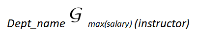

#### Example2

Consider the following relational chema for a library:

​    member(member_no, name, dob)

​    books(isbn, title, authors, publisher)

​    borrowed(member_no, isbn, date)

 Write the following queries in ralational algebra.

1、Find the names of members who have borrowed any book published by "McGraw-Hill".

2、Find the names of members who have borrowed all books published by "McGraw-Hill".

3、Find the name and membership number of members who have borrowed more than five different books published by "McGraw-Hill".

```
1、写关系代数时，也可以尽量先做选择
```

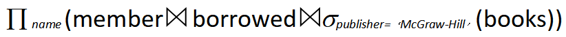

2、

