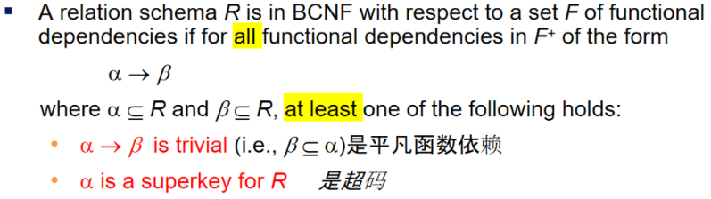
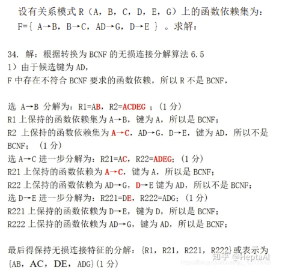
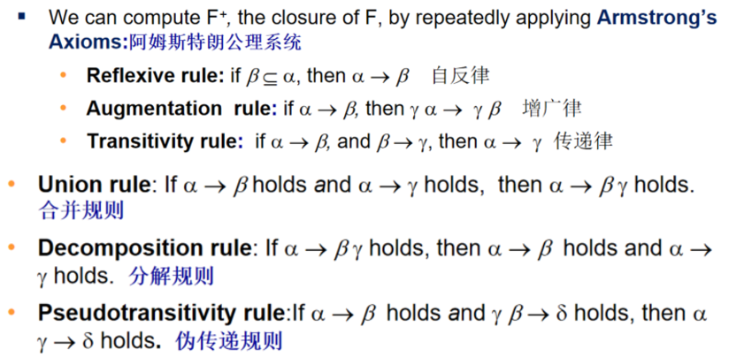
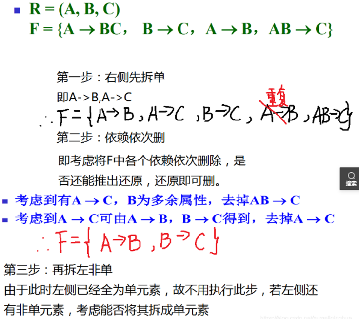

- [无损连接、函数依赖和码](#无损连接函数依赖和码)
    - [敲黑板——求候选码](#敲黑板求候选码)
- [范式](#范式)
    - [2NF](#2nf)
    - [3NF](#3nf)
    - [敲黑板——3NF相关题目](#敲黑板3nf相关题目)
    - [BCNF](#bcnf)
    - [敲黑板——BCNF相关题目](#敲黑板bcnf相关题目)
- [函数依赖](#函数依赖)
    - [函数依赖闭包](#函数依赖闭包)
    - [属性闭包](#属性闭包)
      - [正则覆盖概念](#正则覆盖概念)
      - [正则覆盖算法](#正则覆盖算法)


## 无损连接、函数依赖和码

**函数依赖**

我们可以这么理解（但并不是特别严格的定义）：

若在一张表中，在属性（或属性组）X的值确定的情况下，必定能确定属性Y的值，那么就可以说Y函数依赖于X，写作 X → Y。（类似函数中的一个X确定唯一一个Y）

**完全函数依赖**

在一张表中，若 X → Y，且对于 X 的任何一个真子集（假如属性组 X 包含超过一个属性的话），X ' → Y 不成立，那么我们称 Y 对于 X 完全函数依赖**。**

**Eg:**（学号，课名） F→分数（注：因为同一个的学号对应的分数不确定，同一个课名对应的分数也不确定）

**部分函数依赖**

假如 Y 函数依赖于 X，但同时 Y 并不完全函数依赖于 X，那么我们就称 Y 部分函数依赖于X。

**Eg:**（学号，[课名](https://www.zhihu.com/search?q=课名&search_source=Entity&hybrid_search_source=Entity&hybrid_search_extra={"sourceType"%3A"answer"%2C"sourceId"%3A29189700})）P→姓名

**传递函数依赖**

比较简单，就是X—>Y, Y—>Z,那么有X—>Z

**码**(就是基于函数依赖产生的概念啦！)

若除 K 之外的所有属性都完全函数依赖于 K（这个“完全”不要漏了），那么我们称 K 为**候选码**，简称为**码**。

(K is a candidate key for R if and only if K → R, and for no α K, α →R

即：K是超码，但是他的真子集不是超码；候选码是最小的超码）

**超码**

只要能唯一表出一个元组，那就是超码。另外，候选码是最小的超码。

**主属性**

包含在任何一个码中的属性称为主属性。

#### 敲黑板——求候选码

参考 CSDN博主https://blog.csdn.net/weiyongle1996/article/details/73481163

```
求候选码的简单方法方法：
（1）如果有属性不在函数依赖集中出现，那么它必须包含在候选码中；
（2）如果有属性不在函数依赖集中任何函数依赖的右边出现，那么它必须包含在候选码中；
（3）如果有属性只在函数依赖集的左边出现，则该属性一定包含在候选码中。
（4）如果有属性或属性组能唯一标识元组，则它就是候选码；

算法：按以下步骤求候选键：
1.只在FD右部出现的属性，不属于候选码;
2.只在FD左部出现的属性，一定存在于某候选码当中;
3.外部属性一定存在于任何候选码当中;
4.其他属性逐个与2,3的属性组合，求属性闭包，直至X的闭包等于U,若等于U,则X为候选码。

例1：R<U,F>,U=(A,B,C,D,E,G),F={AB-->C,CD-->E,E-->A.A-->G},求候选码。

  因G只在右边出现,所以G一定不属于候选码;而B,D只在左边出现,所以B,D一定属于候选码;BD的闭包还是BD,则对BD进行组合,除了G以外,BD可以跟A,C,E进行组合
  先看ABD
  ABD本身自包ABD,而AB-->C,CD-->E,A-->G,所以ABD的闭包为ABDCEG=U
  再看BDC
  CD-->E,E-->A,A-->G,BDC本身自包,所以BDC的闭包为BDCEAG=U
  最后看BDE
  E-->A,A-->G,AB-->C,BDE本身自包,所以BDE的闭包为BDEAGC=U
  因为(ABD)、(BCD)、(BDE)的闭包都是ABCDEG所以本问题的候选码有3个分别是ABC、BCD和BDE
```

## 范式

在数据库模式涉及中，我们不大可能一开始就设计出完美的模式——没有冗余，没有潜在的不一致性（满足主码约束，函数依赖，check约束，断言和触发器），满足函数依赖。***（这边的解释可能不那么严谨）***

于是，我们需要进行分解，分解的方法是多种的，但是：只有能够保证分解后的关系模式与原关系模式等价，分解方法才有意义。

所以，就有一套规则来指导我们进行分解，我们称这些规则为“范式”，同时也有了相应的一系列算法。但是注意，范式的作用也是有限的，一般来说，越高级的范式，它越可以满足冗余和函数依赖相关的要求。**（这边的解释可能不那么严谨）**

#### 2NF

在实际中已经不使用了，所以仅做了解：

2NF在1NF（就是最原始的表格，所有信息都放上去，而且一对一，没有复合属性）的基础之上，消除了非主属性对于码的部分函数依赖。

#### 3NF

3NF在2NF的基础之上，消除了非主属性对于码的传递函数依赖：

**Eg: ** 对于**学生**表，主码为**学号**，主属性为**学号**，非主属性为**姓名**、**系名**和**系主任**。因为学号→系名，同时系名→系主任，所以存在非主属性**系主任**对于码**学号**的传递函数依赖，所以**学生**表的设计，不符合3NF的要求。

#### 敲黑板——3NF相关题目

参考CSDN博主https://blog.csdn.net/Game_Zmh/article/details/88089813

```
验证算法（验证分解是否为3NF）
不需要求闭包
方法1：(一个简单的办法)
如果有主键x,还有非主键y z w，如果有其他的非主键之间的依赖比如y->z 则不满足3NF，
因为有主键肯定能推出非主键即，x->y,而又有y-z,所以存在传递依赖，则不满足3NF，否则满足3NF。
```

```
【例】关系模型R<U，F>，U={A，B，C，D，E}，F={A→BC，ABD→CE，E→D}
算法一：将关系R转化3NF的保持函数依赖的分解
第一步：首先计算出F的最小依赖集（算法详见最小函数依赖(正则覆盖)），得到F'={A→BC，AD→E，E→D}。

第二步：观察U中是否有属性不在F'中的出现，如果有，则这个个属性组成一对关系R,并在原来的U中删除这些属性。而例子中U中的属性都出现在F中，则可以跳过这一步。

第三步：对F'中的函数依赖，把左边的相同分为一组，一组中出现的所有属性为一个关系。
如F={A→B，A→C，……}，左边都为A的分为一组，列出项的所有属性组为一个关系R{A，B，C，……}。
例题中左边都不相同，所以一个函数依赖组为一个关系得到转化为3NF的保持依赖分解R1{A,B,C}，R2{A,D,E}，R3{E,D}。

算法二：将关系R转化3NF的既有无损连接性又保持函数依赖的分解
第一步：先将R转化3NF的保持函数依赖的分解，由算法一得出R1{A,B,C}，R2{A,D,E}，R3{E,D}。

第二步：求出F的候选码（算法相见候选码算法）得出候选码X为AD和AE。

第三步：将候选码单独组成关系得R4{A,D}和R5{A,E}，然后与保持函数依赖后的分解取并集。得R1{A,B,C}，R2{A,D,E}，R3{E,D}，R4{A,D}，R5{A,E}。

第四步：观察新组成的分解模式中，是否存在包含关系，有则去掉被包含的。如R3{E,D}，R4{A,D}，R5{A,E}都包含于R2{A,D,E}，则删去，最终得到转化3NF的既有无损连接性又保持函数依赖的分解R1{A,B,C}，R2{A,D,E}。
```

#### BCNF

在 3NF 的基础上消除主属性对于码的部分与传递函数依赖。

定义：



#### 敲黑板——BCNF相关题目

参考CSDN[四、转换成BCNF的保持无损连接的分解_bcnf分解例题-CSDN博客](https://blog.csdn.net/ristal/article/details/6652020)

知乎[(9 封私信 / 80 条消息) HeptaAI - 知乎 (zhihu.com)](https://www.zhihu.com/people/jackgethome)

```
验证算法（验证分解是否为BCNF）
对于一个关系R，每个函数依赖X→Y的左侧都包含关系R的码，
也就是说每个函数依赖的左侧都是关系R的一个超码，那么这个关系R是BCNF范式的。
还有一种方法是要求闭包的，但其实不需要求闭包
```

```
分解算法（把模式分解为BCNF）
1、求出候选码
2、观察函数依赖集，如果左边不是超码（候选码），则不满足条件
3、对不满足条件的函数依赖R(A->B)进行分解:（如何分解）
	 R1 = (R-B)
   R2 = (A,B) // 或者AB
4、看R1和R2是否都满足BCNF了
5、重复直到所有的满足条件

例子：
设有关系模式R<U,F>其中：U={C,T,H,R,S,G};F={CS->G,C->T,TH->R,HR->C,HS->R},将其分解为无损连接的BCNF.
解：求得R的候选码为HS,
1）令ρ={CTHRSG}；（初始化为属性集）
2）ρ中模式不是BCNF(左部依赖并不是都包含HS)，继续③；
3）在CS->G中，CS不包含HS,不满足BCNF,将ρ分解为CSG与CTHRS，转②。
ρ中模式为{CSG，CTHRS}，关系CSG依赖为CS->G,满足bcnf，关系CTHRS依赖为C->T,TH->R,HR->C,HS->R(左部依赖并不是都包含候选码HS)，不满足bcnf，继续分解关系CTHRS，关系CTHRS中选择C->T，C不包含关系CTHRS的候选码HS,同理分解为CT与CHRS,转②。
ρ中模式为{CSG，CT，CHRS}，关系CT依赖为C->T,满足bcnf，关系CHRS依赖为CH->R,HR->C,HS->R(左部依赖并不是都包含候选码HS),不满足bcnf，继续分解关系CHRS，关系CHRS中选择CH->R，CH不包含关系CHRS的候选码HS,同理分解为CHR与CHS,转②。
ρ中模式为{CSG，CT，CHR,CHS}，关系CHR依赖为CH->R,HR->C,满足bcnf，关系CHS依赖为HS->C满足bcnf转④。
4)停止分解，输出ρ={CSG，CT，CHR,CHS}；
```



## 函数依赖

范式的生成和检验其实是基于“函数依赖”的，所以我们需要一套函数依赖理论。

#### 函数依赖闭包

若F为关系模式R(U)的函数依赖集，我们把F以及所有被F逻辑蕴涵的函数依赖的集合称为F的闭包；


如何求F逻辑蕴含的函数依赖呢？（依据一系列的规则）



#### 属性闭包

求属性的闭包而不是函数的闭包)

当用户在关系上执行更新时，数据库系统需要保证这个更新不会破坏关系的函数依赖，所以需要对更新进行检验（而且注意，检验时，不仅要考虑是否和给定的函数依赖集一致，还要考虑是否和模式上成立的所有函数依赖一致；也就是求“函数闭包”）

听起来很麻烦，为了简化这一过程，对一个函数依赖集，我们求她的正则覆盖（也就是简化集）

##### 正则覆盖概念

正则覆盖可以理解为是消去了无关元素的函数依赖集。计算方法是从 F 使用合并的方式来替换掉所有的依赖，接下来依次删除所有的无关元素。

##### 正则覆盖算法

参考CSDN[【通俗易懂】关系模式范式分解教程 3NF与BCNF口诀!小白也能看懂-CSDN博客](https://blog.csdn.net/sumaliqinghua/article/details/86246762)

右侧先拆单，依赖依次删；还原即可删，再拆左非单。

