[TOC]

参考哈工大战德臣老师PPT

## 查询优化的Why和How

1. 效率：如果数据量很大的话，不是直接写一条简单的查询语句就可以的，可能要查询指数级别的条目——所以本质目的是优化时间

so how

- 语义优化：利用模型的语义和完整性规则来优化
- 语法优化：就是逻辑层优化，利用语法结构
- 执行优化：就是物理层优化，**存取路径**和**执行算法**的选择与**执行次序**

## 基本思路

#### 语义优化

对一个查询语句，我们优化，可以“去掉无关的表”“去掉无关的属性”，还可以改写成“等价的效果更好的语句”，（个人理解）这个等价就是语义的等价性。为了让DBMS自动来实现这个等价性，我们是使用的完整性规则。

（*目前这个领域有待研究*）

#### 语法优化

用户输入一个查询语句之后，编译器会把查询语句转换成关系代数的形式，根据关系代数选择相应的算法（连接，投射，选择等），但是，如我们一开始**Why**说的,不能直接这么做，DBMS还要对这个关系代数进行优化：尽可能地，早做选择，早做投射。

那么，DBMS怎么知道如何调换这些选择、投射、连接操作的顺序呢：

根据**关系代数表达式的等价变换定理**，尝试**交换关系代数五种基本操作的次序**，看交换之后**是否等价**，最终形成查询逻辑计划。

#### 物理优化

有了查询计划之后，就可以调用相应的程序了，由于对同一操作有不同的程序例程，所以就有了物理优化：

根据<u>**代价估算**</u>，选择代价最少的**<u>例行程序</u>**和**<u>相应参数</u>**。

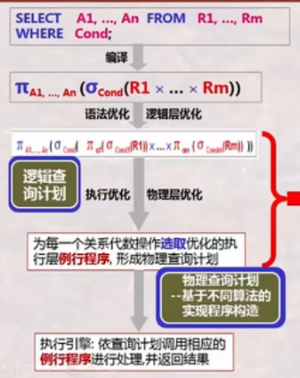

#### 优化总览

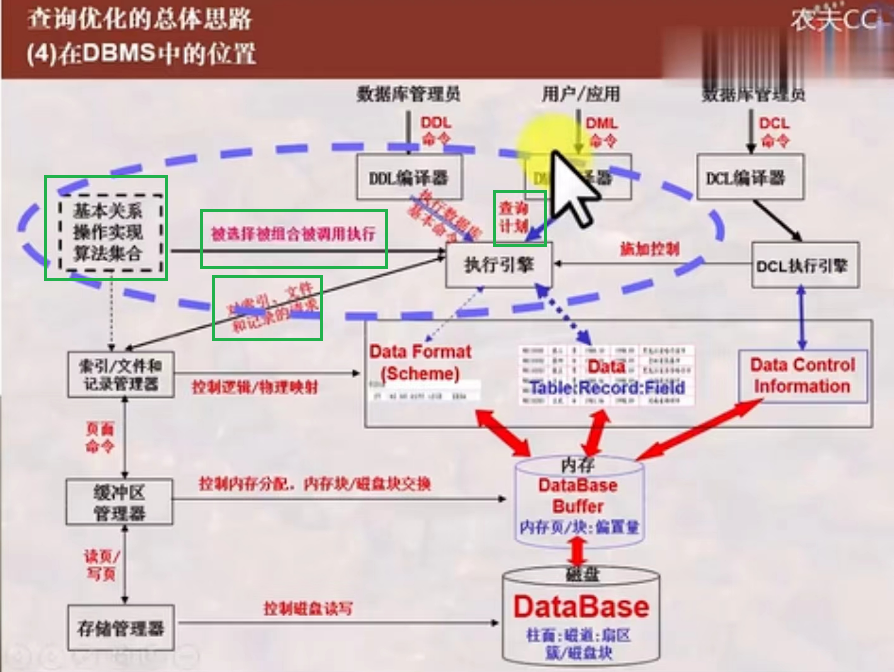

查询优化之后，执行引擎执行，这里之后涉及索引、文件、缓冲区等；就是之前的knob；数据库整体优化也可以从这里出发。

## 细说语法优化

#### 语法树

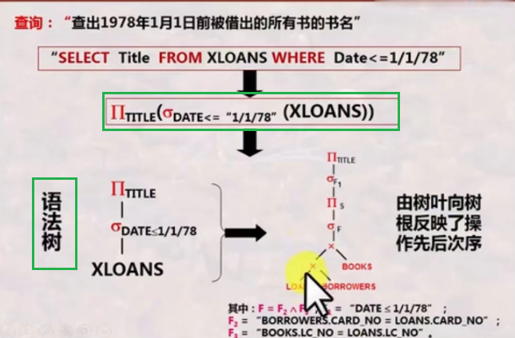

在实现上，首先把查询**转换为一棵树**，包括展开查询里面的**试图**，然后，对这棵树进行优化（其实就是合法地交换树的结点）。优化策略有：

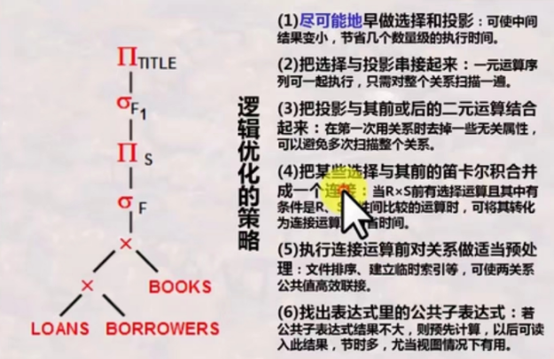

最后的效果会像这样：

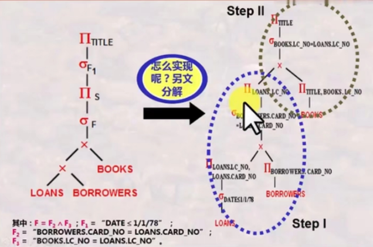

#### 合法交换节点的理论基础（关系代数次序交换等价性）

基本操作：并；差；积；选择；投影

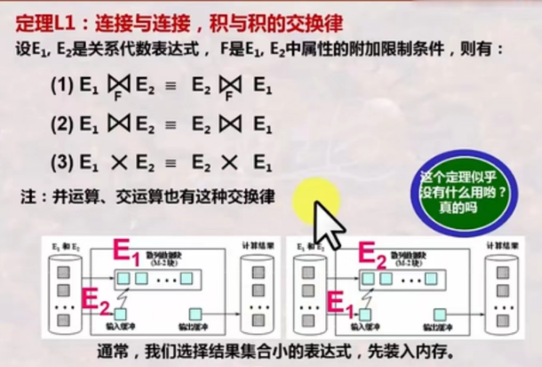

Explain: 交换律的实质作用就是“选择把谁放入内存”

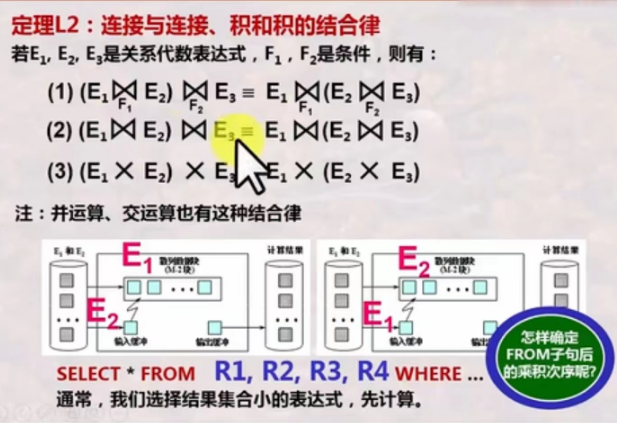

Explain: 把比较小的先放入内存中

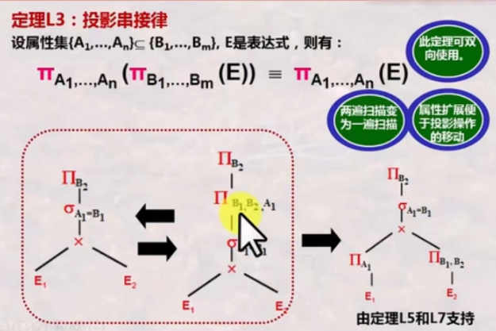

Explain: 注意是属性之间有包含关系才可以；记得我们说的优化规则之一是要先进行投影操作吗，这个例子里面就是把投影操作放到了×操作的前面。

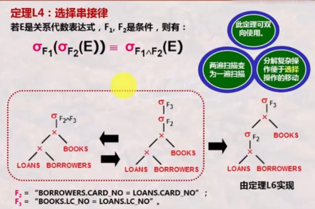

Explain: 可以双向使用；但是到底降低扫描次数收益高还是移动选择操作收益高就是看实际场景了，会有不同。

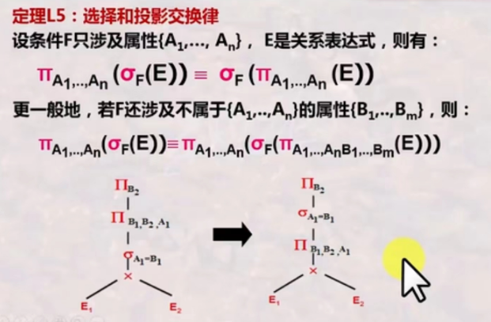

Explain: 一般情况的例子就是先拓展属性再做投影。

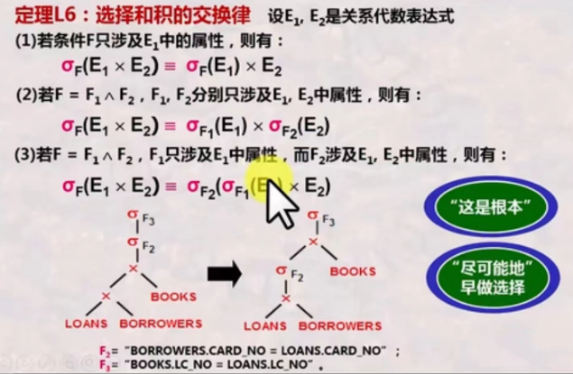

Explain: 这是一条非常**基本的规则**

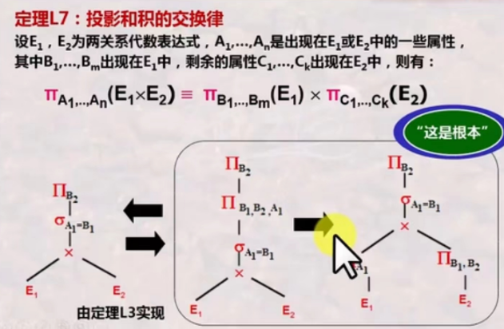

Explain: 这是也一条非常**基本的规则，**我们希望尽早地做投影；可以减小每条记录的长度，增大内存使用率。

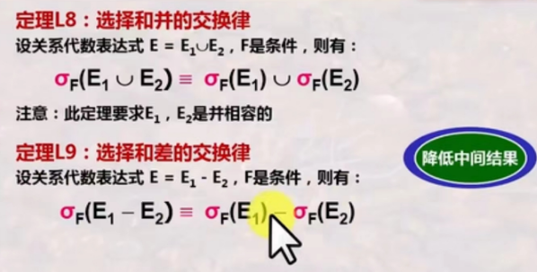

Explain: 减小中间结果的体积，有助于合理使用内存空间（避免空间窘迫）

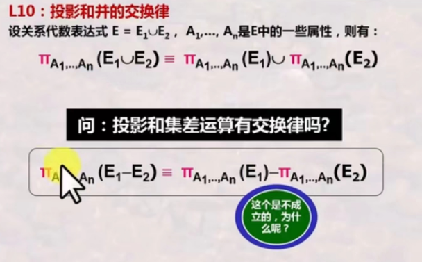

Explain:关于做差为啥不能分开，其实很显然，分开之前是对属性做差再投影；分开后，两边分别投影再做差，投影之后，元素可能大大地不同了。

#### 合法交换节点的理论基础（简洁版本）

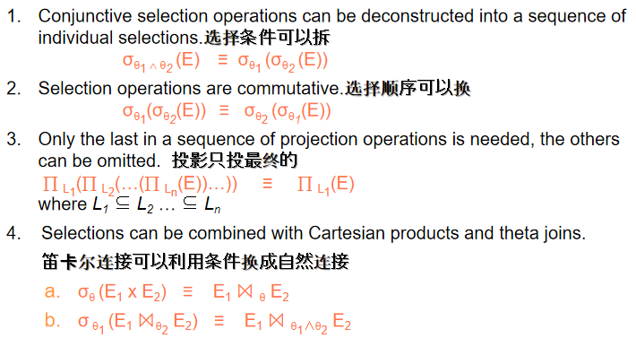

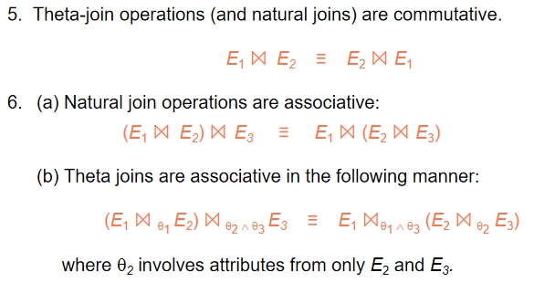

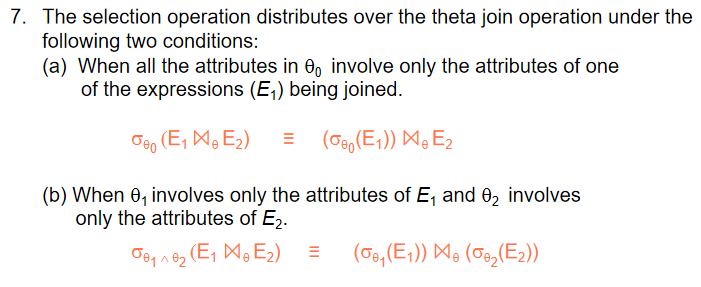

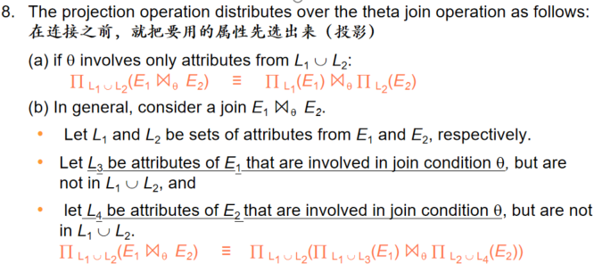

